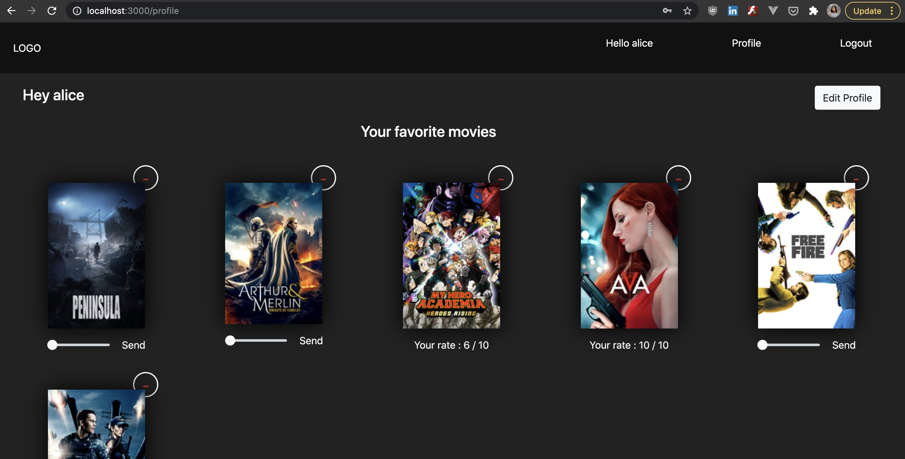
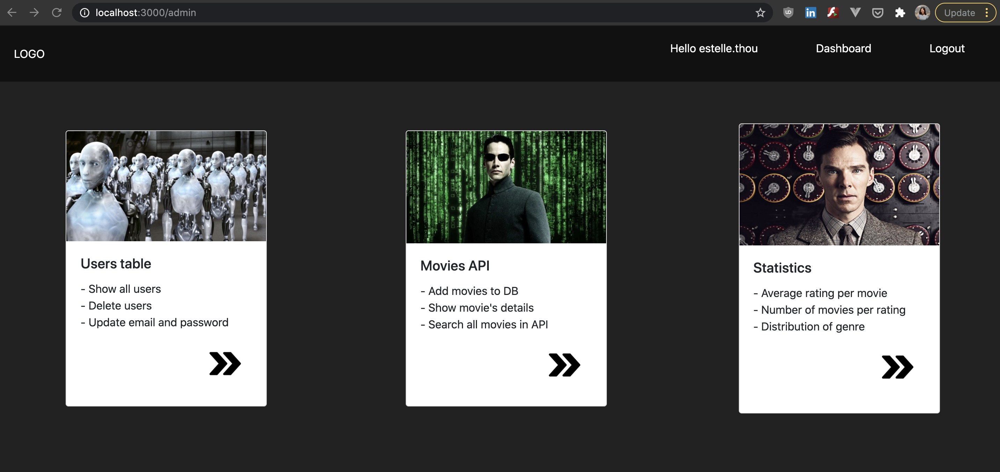
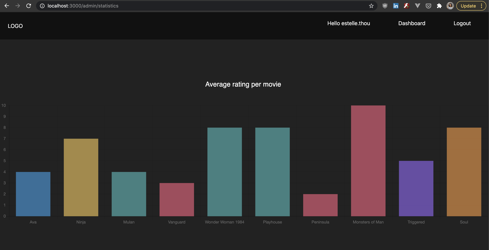

This is a [Next.js](https://nextjs.org/) project bootstrapped with [`create-next-app`](https://github.com/vercel/next.js/tree/canary/packages/create-next-app).

## Introduction 

This Next app using MongoDB Atlas and TheMovieDatabaseAPI (https://developers.themoviedb.org/3/getting-started/introduction).
The authentication is based on Auth0 API. (https://auth0.com/docs/api)
This website shows movies with details, rating and comments. User logged can have a favorite list and is able to rate and give comment on movie they watched. 


### Home page 
| width=80)

### Profile 
| width=80)

### Dashboard 
| width=80)

### Dashboard 
| width=80)


## Getting Started

First, run the development server:

```bash
npm run dev
# or
yarn dev
```

Open [http://localhost:3000](http://localhost:3000) with your browser to see the result.

You can start editing the page by modifying `pages/index.js`. The page auto-updates as you edit the file.

## Learn More

To learn more about Next.js, take a look at the following resources:

- [Next.js Documentation](https://nextjs.org/docs) - learn about Next.js features and API.
- [Learn Next.js](https://nextjs.org/learn) - an interactive Next.js tutorial.
